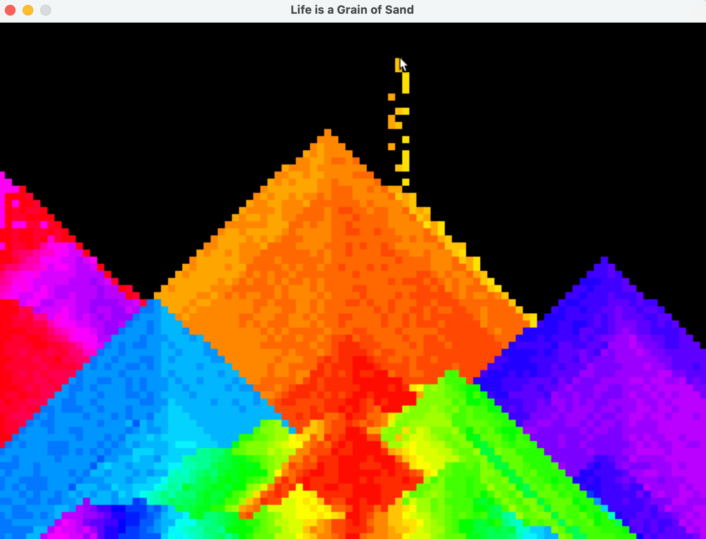

# Falling Sand Simulator
Life is like a grain of sand. Why? Because we're just too tiny to comprehend... 
My little evening project is a falling-sand-simulator to draw pyramids with a gravitational pull effect. 
Turns out, this simple cellular automata transforms simple mouse-hold-downs into structures that are very satisfying, in my opinion.

Inspired by [The Coding Train](https://www.youtube.com/watch?v=L4u7Zy_b868) ; written in C++ instead of JS for performance. :-)

